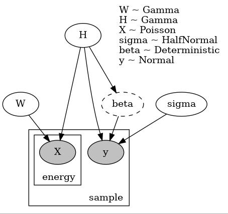

# Poisson Non-negative Matrix Factorization for Linear Regression

# Model
下記にこのモデルのグラフィカルモデルを示す．

## Matrix factorization
観測されたスペクトルデータセット$`X \in \mathbb{R}_{+}^{D \times N}`$は期待値を$`\Lambda`$とする$Poisson分布$`\mathcal{P}(\lambda)`$から生成されると仮定すると：

$$
    X \sim \mathcal{P}(\Lambda)　\text{where}　\Lambda = WH.
$$

スペクトルデータの要素$`X_{ij}`$は独立だと仮定する：

$$
    X_{ij} \sim \mathcal{P}(\Lambda_{ij})　\text{where}　\Lambda_{ij} = \sum_{k=1}^{K}{W_{ik} H_{kj}}.
$$

ここで，$`\Lambda`$は$`K`$次元の潜在変数により行列分解できると仮定する．$`D`$はエネルギー方向の次元数で，$`N`$はサンプル方向の次元数である．

基底スペクトル$`W \in \mathbb{R}_{+}^{D \times K}`$，潜在変数$`H \in \mathbb{R}_{+}^{K \times N}`$は，それぞれ非負を仮定するため，ガンマ分布$`\mathcal{G}(a, b)`$から生成する：

$$
    W_{ik} \sim \mathcal{G}(a_W, b_W), \text{}　H_{kj} \sim \mathcal{G}(a_H, b_H).
$$

## Regression
目的変数$`\boldsymbol{y} \in \mathbb{R}^{N}`$は，潜在変数を係数$`\boldsymbol{\beta} \in \mathbb{R}^{K}`$による線形和で表現でき，分散$`\sigma^2`$のガウス分布から生成されると仮定する：

$$
    y_{j} \sim \mathcal{N}(\mu_y = \boldsymbol{\beta} H_{:j}, \sigma_y^2=\sigma^2)
$$

回帰係数$`\boldsymbol{\beta}`$と分散$`\sigma^2`$はそれぞれガウス分布と半正規分布から生成されると仮定する．サンプリングにおいては，回帰係数$`\boldsymbol{\beta}`$は，最小２乗法により確定的に推定する．

# Example

## 生成したデータ

## 真のスペクトル基底

## 真のターゲット変数の生成

真の重み係数$`\beta_{t}`$を$`\beta_{t} = (1.0, 1.5, -1.0, -1.5)^{\top}`$に設定した．  
ターゲット変数の真の観測ノイズ$`\sigma_t`$は$`\sigma_t=0.7`$に設定した．

# Result

## Typical NMF for comparison

### 推定されたスペクトル基底

## Our method

### 推定されたスペクトル基底

### ターゲット変数の回帰結果

### 回帰の観測ノイズの事後分布

